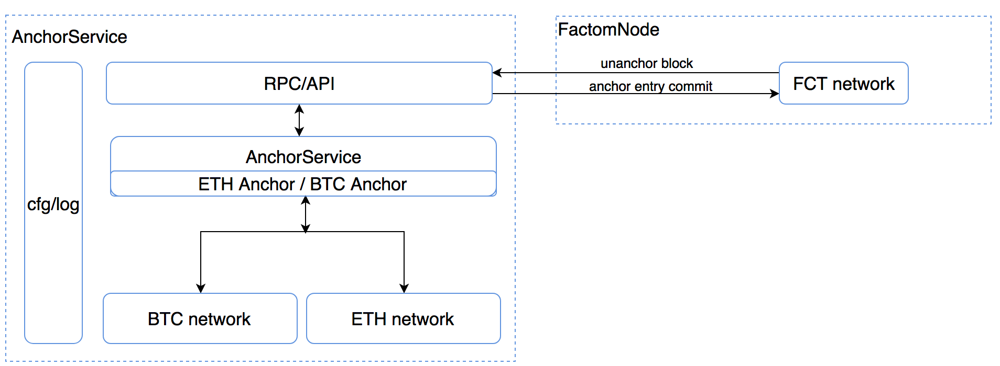
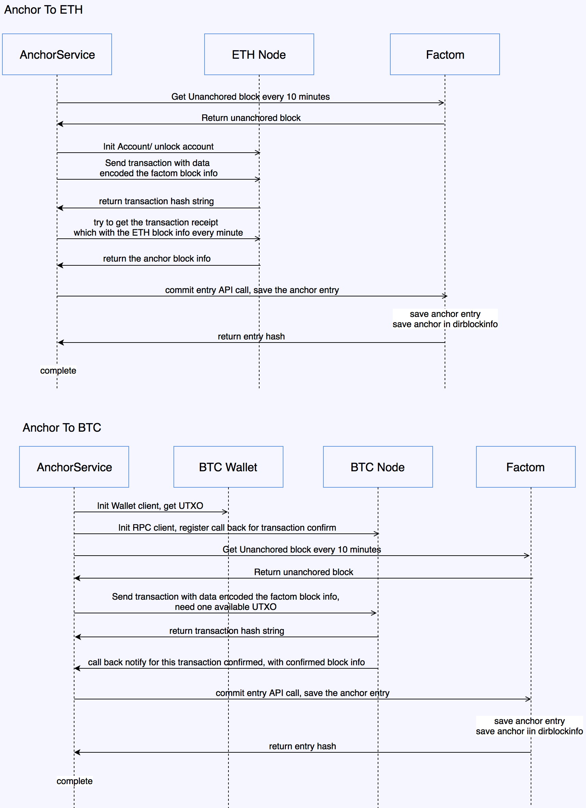

# AnchorService

#### Anchor Factom Block to BTC or ETH


### Architecture


### RunFlow


### Fee cost

1. ETH save money: [check this](https://ropsten.etherscan.io/tx/0x056775fa3b2265d44f75b39f4a15f955959c07f9309148636acbe1e56a238f00) or [this](https://ropsten.etherscan.io/address/0x100c8b406978a413c4305b3aa6074f734fee6c9c)
2. BTC is expensive: [check this](https://www.blocktrail.com/tBTC/tx/8ae6a8186cb2aaca08761f7d4329d2044b04cc1cb3e7603a4a68a268e32ffc73) or [this](https://www.blocktrail.com/tBTC/address/muhwpK9H139vNgufiudcAZP37aKMpmqH4t/transactions)

Seems use ETH more better.

### Run test
1. ETH: 

```
./geth --testnet --fast --cache=512 --rpc --rpcapi="eth,personal"
```

2. BTCD

```
./btcd --rpcuser=jbi --rpcpass=jbi123456 --testnet
```

```
./btcwallet --username=jbi --password=jbi123456 --testnet
```

3. AnchorService
use the default configuation file, change as need, just run ./anchorservice

### Build bin

1. go get  
2. git clone sys, net, crypto under src/golang.org/x:
    git clone https://github.com/golang/sys/
    git clone https://github.com/golang/net/
    git clone https://github.com/golang/crypto/
    
3. for btcutil: git checkout 61ec18f9c8a4552c209416ce363592e35e416997